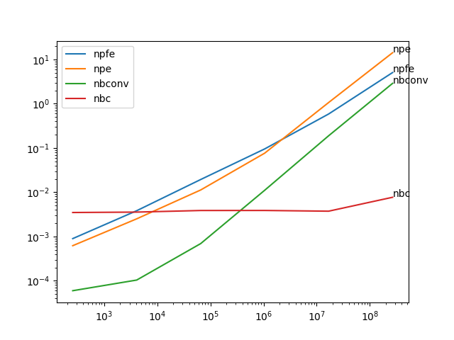
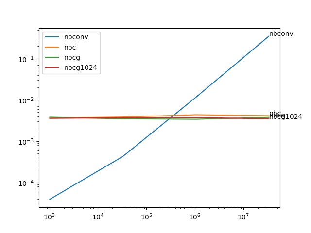

# Python Convolution Comparisons

Convolutions are a fundamental operation in scientific computing.  The goal here is to explore the possible approaches in python.  A convolution is a sliding dot product.

# 1D First Order
An example 1D signal could be audio amplitudes.  An example filter would be an impulse response.  The filter slides over a window of the larger audio signal.  Corresponding terms are multiplied and then summed together to construct a filtered version of the signal.

It was found that numpy.convolve is the fastest for a large variety of inputs, but after a sufficiently large size it makes sense to use cupy.  The gpu implementations started to become worth using at around 10^7.

Best to worst for larger arrays:
*  cpste - cupy strided [@Alexer](https://github.com/alexer)
*  nbc_gm, nbc - numba cuda improvement from [@gmarkall](https://github.com/gmarkall)
*  cpv, spfcv, spvc, npc
  *  cpv - cupyx.scipy.ndimage,
  *  spvc - scipy.signal.convolve
  *  spfvc - scipy.signal.fftconvolve
  *  npc - numpy.convolve
*  npste - numpy strided [@Alexer](https://github.com/alexer)
*  nbpd_np - numba parallel dot, no gil
*  nbp - numba parallel
*  nbnpc_nj - @njit numba numpy convolve
*  npd - numpy dot
*  npfe - numpy for einsum
*  naive - (not shown) two for loops, significantly worse

# 1D Second Order

Best to worst for larger arrays:
*  nbconv - numba njit (naive implementation with njit)
*  npfe - numpy for loop einsum (generate the outer product on demand)
*  npe - numpy einsum (generate the outer product all at once first)
*  nbc - numba cuda (naive implementation with @cuda.njit)

# 1D Third Order

Best to worst for larger arrays:
*  nbconv - numba njit (naive implementation with njit)
*  nbc - numba cuda (naive implementation with @cuda.njit)
*  nbcg - numba cuda (naive implementation with @cuda.njit and grid)

Best to worst for larger arrays:
*  nbcg - numba cuda (naive implementation with @cuda.njit and grid, 128 is faster than 1024 (t/b))
*  nbconv - numba njit (naive implementation with njit)
